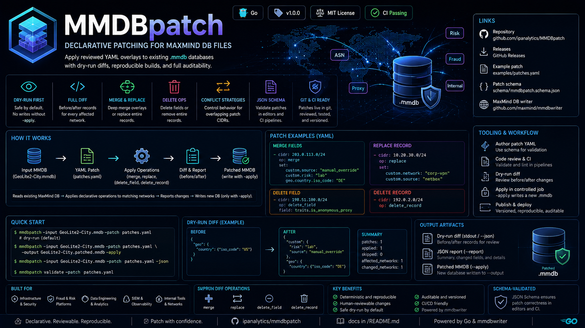
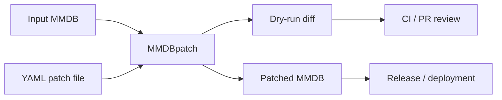

# MMDBpatch

Declarative patching for MaxMind DB files. MMDBpatch applies reviewed YAML overlays to existing `.mmdb` databases, producing reproducible patched databases with dry-run diffs suitable for infrastructure, security, fraud/risk, and analytics workflows.

<p align="center">
  
</p>

<p align="center">
  <a href="https://github.com/ipanalytics/MMDBpatch/actions/workflows/release.yml"></a>
  <a href="https://github.com/ipanalytics/MMDBpatch/releases"></a>
  <a href="./LICENSE"></a>
  
  
</p>

---

## Links

| Resource | Location |
| --- | --- |
| Repository | [github.com/ipanalytics/MMDBpatch](https://github.com/ipanalytics/MMDBpatch) |
| Releases | [GitHub Releases](https://github.com/ipanalytics/MMDBpatch/releases) |
| Example patch | [examples/patches.yaml](./examples/patches.yaml) |
| Patch schema | [schema/mmdbpatch.schema.json](./schema/mmdbpatch.schema.json) |
| MaxMind DB writer | [github.com/maxmind/mmdbwriter](https://github.com/maxmind/mmdbwriter) |

## Overview

Operational teams often maintain local corrections and enrichment data for GeoIP, ASN, proxy, risk, or internal network datasets. The usual path is a one-off Go program using `mmdbwriter`, which makes the result hard to review, repeat, and audit.

MMDBpatch turns those corrections into data:

```yaml
# yaml-language-server: $schema=https://raw.githubusercontent.com/ipanalytics/MMDBpatch/main/schema/mmdbpatch.schema.json
defaults:
  conflict: patch_wins

patches:
  - cidr: 203.0.113.0/24
    op: merge
    set:
      custom.source: "manual_override"
      custom.risk: "lab"
      geo.country.iso_code: "DE"

  - cidr: 198.51.100.0/24
    op: delete_field
    field: traits.is_anonymous_proxy
```

Patch files can live in git, go through code review, run in CI, and be applied during controlled release jobs.

## System Behavior

MMDBpatch reads an existing MaxMind DB, loads a YAML patch document, and applies each operation to the matching network using `mmdbwriter.InsertFunc`.



By default the CLI performs a dry run and prints before/after records for each affected network. Writing a database requires an explicit `-apply` flag and output path.

## Features

| Capability | Description |
| --- | --- |
| Declarative patches | YAML operations for CIDR-scoped MMDB changes. |
| Patch validation | Validate YAML patch files without an input database. |
| JSON Schema | Editor and CI validation through `schema/mmdbpatch.schema.json`. |
| Dry-run first | Default mode prints the proposed changes without writing output. |
| Full affected-network diff | Uses `NetworksWithin` to report affected records under the patched CIDR. |
| Before/after diff | Human-readable, JSON-lines, or full JSON report output. |
| Merge semantics | Deep-merge overlay values while preserving unrelated record fields. |
| Record replacement | Replace selected networks with controlled records. |
| Field deletion | Remove specific dotted paths from selected records. |
| Record deletion | Remove selected networks from the database tree. |
| Conflict strategies | Define behavior for overlapping patch CIDRs. |
| Reproducible output | Same input database and patch file produce the same patched result. |

## Quick Start

```sh
mmdbpatch \
  -input GeoLite2-City.mmdb \
  -patch patches.yaml
```

Apply the patch and write a new database:

```sh
mmdbpatch \
  -input GeoLite2-City.mmdb \
  -patch patches.yaml \
  -output GeoLite2-City.patched.mmdb \
  -apply
```

Emit machine-readable diff records:

```sh
mmdbpatch \
  -input GeoLite2-City.mmdb \
  -patch patches.yaml \
  -json
```

Write the full report to a JSON file:

```sh
mmdbpatch \
  -input GeoLite2-City.mmdb \
  -patch patches.yaml \
  -report reports/mmdbpatch.json
```

Validate a patch file without opening an MMDB:

```sh
mmdbpatch validate -patch patches.yaml
```

## Installation

Install from source:

```sh
go install github.com/ipanalytics/MMDBpatch/cmd/mmdbpatch@latest
```

Build locally:

```sh
git clone https://github.com/ipanalytics/MMDBpatch.git
cd MMDBpatch
go build ./cmd/mmdbpatch
```

Released binaries are published for Linux, macOS, and Windows on the [releases page](https://github.com/ipanalytics/MMDBpatch/releases).

## Usage

```text
Usage of mmdbpatch:
  -apply
        write the patched MMDB instead of dry-run only
  -input string
        input MMDB path
  -json
        print dry-run diff as JSON lines
  -output string
        output MMDB path; requires -apply
  -patch string
        YAML patch file path
  -report string
        write full JSON report to path
  -version
        print version information
```

Patch validation:

```text
Usage of mmdbpatch validate:
  -patch string
        YAML patch file path
```

### Merge Fields

```yaml
patches:
  - cidr: 203.0.113.0/24
    op: merge
    set:
      custom.owner: "security"
      custom.environment: "lab"
      geo.country.iso_code: "DE"
```

### Replace a Record

```yaml
patches:
  - cidr: 10.20.30.0/24
    op: replace
    set:
      custom.network: "corp-vpn"
      custom.source: "netbox"
```

### Delete a Field

```yaml
patches:
  - cidr: 198.51.100.0/24
    op: delete_field
    field: traits.is_anonymous_proxy
```

### Delete a Record

```yaml
patches:
  - cidr: 192.0.2.0/24
    op: delete_record
```

## Outputs

MMDBpatch produces three operational artifacts:

| Artifact | Description |
| --- | --- |
| Dry-run diff | Before/after records for each affected network, printed to stdout. |
| JSON report | Complete report written with `-report`, including summary counters and changed fields. |
| Patched MMDB | New MaxMind DB file written only when `-apply` and `-output` are set. |

Example human-readable dry-run output:

```text
merge 203.0.113.0/24
  before: {"geo":{"country":{"iso_code":"US"}}}
  after:  {"custom":{"risk":"lab","source":"manual_override"},"geo":{"country":{"iso_code":"DE"}}}
patches: 1, applied: 1, skipped: 0, affected_networks: 1, changed_networks: 1
```

Example JSON-lines output:

```json
{"cidr":"203.0.113.0/24","network":"203.0.113.0/24","op":"merge","changed":true,"fields_changed":["custom.risk","custom.source","geo.country.iso_code"],"before":{"geo":{"country":{"iso_code":"US"}}},"after":{"custom":{"risk":"lab","source":"manual_override"},"geo":{"country":{"iso_code":"DE"}}}}
```

Example report summary:

```json
{
  "total": 2,
  "applied": 2,
  "skipped": 0,
  "affected_networks": 2,
  "changed_networks": 2,
  "fields_changed": [
    "custom.source",
    "geo.country.iso_code",
    "traits.is_anonymous_proxy"
  ]
}
```

## Patch Format

Top-level document:

```yaml
# yaml-language-server: $schema=https://raw.githubusercontent.com/ipanalytics/MMDBpatch/main/schema/mmdbpatch.schema.json
defaults:
  conflict: patch_wins

patches:
  - cidr: 203.0.113.0/24
    op: merge
    set:
      path.to.field: value
```

Supported operations:

| Operation | Required fields | Behavior |
| --- | --- | --- |
| `merge` | `cidr`, `set` | Deep-merges `set` into the existing MMDB record. |
| `replace` | `cidr`, `set` | Replaces the record for the CIDR with `set`. |
| `delete_field` | `cidr`, `field` | Deletes one dotted field path from the existing record. |
| `delete_record` | `cidr` | Removes the record for the CIDR. |

Conflict strategies:

| Strategy | Behavior |
| --- | --- |
| `patch_wins` | Apply patches in file order. Later overlapping patches can refine earlier ranges. |
| `first_wins` | Apply the first patch for an overlapping range and skip later overlapping patches. |
| `fail_on_overlap` | Reject the patch file when two patch CIDRs overlap. |

Set a default for the patch file:

```yaml
defaults:
  conflict: fail_on_overlap
```

Override it for a single patch:

```yaml
patches:
  - cidr: 203.0.113.0/24
    op: merge
    conflict: patch_wins
    set:
      custom.source: "manual_override"
```

Field paths are dot-separated:

```yaml
set:
  geo.country.iso_code: "DE"
```

The path above expands to:

```json
{
  "geo": {
    "country": {
      "iso_code": "DE"
    }
  }
}
```

Nested YAML maps are accepted when they are a better fit for the data.

## Operational Notes

- Treat patch files as release artifacts. Review them the same way you review firewall, routing, detection, or enrichment changes.
- Keep source MMDB checksums with release metadata when reproducibility matters.
- Run dry-run mode in pull requests and deployment previews.
- Use `mmdbpatch validate` in pre-commit hooks and CI jobs.
- Write patched databases to a new path and promote them through the same rollout mechanism used for the original database.
- Use JSON-lines diff output when integrating with CI logs, artifact storage, or approval systems.
- Store full `-report` JSON artifacts for audit trails when overrides affect production datasets.

## Use Cases

| Team | Example |
| --- | --- |
| Security engineering | Override risk metadata for lab, VPN, Tor, proxy, and partner ranges. |
| Fraud/risk | Attach internal scoring tags to high-signal prefixes. |
| Infrastructure | Correct geolocation for office, datacenter, and private interconnect ranges. |
| Analytics | Add stable internal dimensions used by pipelines and dashboards. |
| Data engineering | Keep enrichment patches versioned and reproducible across environments. |

## Project Scope

MMDBpatch focuses on deterministic patching of existing MaxMind DB files. It is intended to be small, auditable, and easy to run in CI.

In scope:

- reading an existing `.mmdb`
- applying CIDR-scoped declarative patch operations
- producing reviewable diffs
- writing a patched `.mmdb`
- supporting automation-friendly output

Out of scope:

- collecting GeoIP, ASN, proxy, VPN, or threat intelligence data
- replacing dataset providers
- operating a hosted enrichment service
- maintaining a central registry of overrides

## Limitations

- Diff reporting follows MaxMind DB network iteration behavior. When a patch CIDR is contained by a larger database network, the containing network is reported as the affected source record.
- Conflict strategies apply to overlapping patch CIDRs. They do not attempt to infer business ownership of fields inside a record.
- Output compatibility depends on the input database structure and reader expectations for that database type.

## Directory Structure

```text
.
├── cmd/mmdbpatch/          # CLI entrypoint
├── examples/               # Example patch files
├── internal/patch/         # Patch parser, diff logic, and MMDB mutation engine
├── schema/                 # JSON Schema for patch files
├── site/                   # Repository visual assets
├── .github/workflows/      # CI and release automation
├── .github/actions/        # Reusable local GitHub Actions
├── go.mod
├── LICENSE
└── README.md
```

## Deployment

MMDBpatch is designed for CI/CD pipelines that already distribute MMDB artifacts.

Typical release job:

```sh
mmdbpatch \
  -input vendor/GeoLite2-City.mmdb \
  -patch overlays/production.yaml \
  -output dist/GeoLite2-City.production.mmdb \
  -apply
```

Recommended pipeline stages:

| Stage | Action |
| --- | --- |
| Validate | Parse patch file and run dry-run diff. |
| Review | Store diff output as a CI artifact or PR comment. |
| Build | Apply patch to a pinned input database. |
| Verify | Run downstream lookup checks against known prefixes. |
| Promote | Publish the patched MMDB through existing artifact rollout. |

### GitHub Actions

This repository includes a local validation action:

```yaml
- uses: ipanalytics/MMDBpatch/.github/actions/validate@v0.1.0
  with:
    patch: overlays/production.yaml
```

For repository-local checks, the included CI workflow validates `examples/patches.yaml`, runs tests, and runs `go vet`.

<details>
<summary>Release workflow</summary>

This repository includes a GitHub Actions workflow that builds release binaries for Linux, macOS, and Windows when a `v*` tag is pushed.

```sh
git tag v0.1.0
git push origin v0.1.0
```

The workflow creates checksums and attaches archives to the GitHub release.

</details>

## License

Apache License 2.0. See [LICENSE](./LICENSE).

## Disclaimer

MMDBpatch modifies databases supplied by the operator. Validate patched output against your deployment requirements before promotion.
