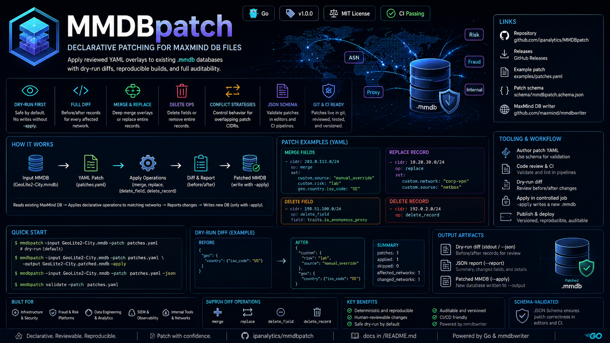
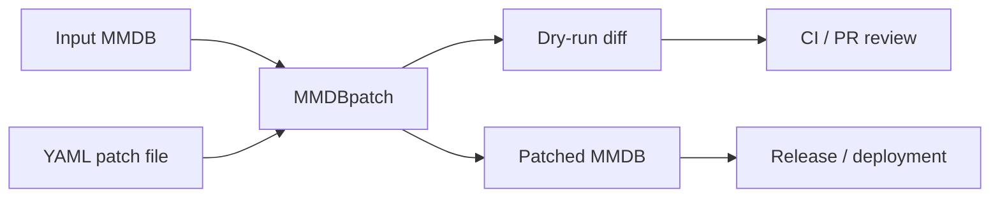

_English version: [README.md](README.md)_

# MMDBpatch

Декларативное внесение исправлений (patching) в файлы MaxMind DB. MMDBpatch применяет проверенные YAML-оверлеи к существующим базам `.mmdb`, формируя воспроизводимые исправленные базы с диффами в режиме dry-run, пригодными для процессов инфраструктуры, безопасности, fraud/risk и аналитики.

<p align="center">
  
</p>

<p align="center">
  <a href="https://github.com/ipanalytics/MMDBpatch/actions/workflows/release.yml"></a>
  <a href="https://github.com/ipanalytics/MMDBpatch/releases"></a>
  <a href="./LICENSE"></a>
  
  
</p>

---

## Ссылки

| Ресурс | Расположение |
| --- | --- |
| Репозиторий | [github.com/ipanalytics/MMDBpatch](https://github.com/ipanalytics/MMDBpatch) |
| Релизы | [GitHub Releases](https://github.com/ipanalytics/MMDBpatch/releases) |
| Пример патча | [examples/patches.yaml](./examples/patches.yaml) |
| Схема патча | [schema/mmdbpatch.schema.json](./schema/mmdbpatch.schema.json) |
| Модуль записи MaxMind DB | [github.com/maxmind/mmdbwriter](https://github.com/maxmind/mmdbwriter) |

## Обзор

Эксплуатационные команды часто ведут локальные исправления и данные обогащения для наборов данных GeoIP, ASN, прокси, risk или внутренних сетей. Обычно для этого используется разовая программа на Go с применением `mmdbwriter`, из-за чего результат трудно проверять, воспроизводить и аудитировать.

MMDBpatch превращает эти исправления в данные:

```yaml
# yaml-language-server: $schema=https://raw.githubusercontent.com/ipanalytics/MMDBpatch/main/schema/mmdbpatch.schema.json
defaults:
  conflict: patch_wins

patches:
  - cidr: 203.0.113.0/24
    op: merge
    set:
      custom.source: "manual_override"
      custom.risk: "lab"
      geo.country.iso_code: "DE"

  - cidr: 198.51.100.0/24
    op: delete_field
    field: traits.is_anonymous_proxy
```

Файлы патчей могут храниться в git, проходить code review, выполняться в CI и применяться в рамках контролируемых задач релиза.

## Поведение системы

MMDBpatch читает существующую базу MaxMind DB, загружает YAML-документ с патчами и применяет каждую операцию к соответствующей сети с помощью `mmdbwriter.InsertFunc`.



По умолчанию CLI выполняет пробный запуск (dry run) и выводит записи «до/после» для каждой затронутой сети. Для записи базы требуется явный флаг `-apply` и путь вывода.

## Возможности

| Возможность | Описание |
| --- | --- |
| Декларативные патчи | YAML-операции для изменений в MMDB с областью действия по CIDR. |
| Валидация патчей | Проверка YAML-файлов патчей без входной базы данных. |
| JSON Schema | Валидация в редакторе и CI через `schema/mmdbpatch.schema.json`. |
| Dry-run по умолчанию | Режим по умолчанию выводит предлагаемые изменения без записи результата. |
| Полный дифф затронутых сетей | Использует `NetworksWithin` для отчёта по затронутым записям под исправляемым CIDR. |
| Дифф «до/после» | Вывод в удобочитаемом виде, в формате JSON-lines или полный JSON-отчёт. |
| Семантика слияния | Глубокое слияние (deep-merge) значений оверлея с сохранением не затронутых полей записи. |
| Замена записей | Замена выбранных сетей контролируемыми записями. |
| Удаление полей | Удаление указанных точечных путей (dotted paths) из выбранных записей. |
| Удаление записей | Удаление выбранных сетей из дерева базы данных. |
| Стратегии конфликтов | Определяют поведение при пересечении CIDR патчей. |
| Воспроизводимый результат | Одна и та же входная база и файл патча дают один и тот же исправленный результат. |

## Быстрый старт

```sh
mmdbpatch \
  -input GeoLite2-City.mmdb \
  -patch patches.yaml
```

Применить патч и записать новую базу данных:

```sh
mmdbpatch \
  -input GeoLite2-City.mmdb \
  -patch patches.yaml \
  -output GeoLite2-City.patched.mmdb \
  -apply
```

Вывести записи диффа в машиночитаемом виде:

```sh
mmdbpatch \
  -input GeoLite2-City.mmdb \
  -patch patches.yaml \
  -json
```

Записать полный отчёт в JSON-файл:

```sh
mmdbpatch \
  -input GeoLite2-City.mmdb \
  -patch patches.yaml \
  -report reports/mmdbpatch.json
```

Проверить файл патча без открытия MMDB:

```sh
mmdbpatch validate -patch patches.yaml
```

## Установка

Установка из исходного кода:

```sh
go install github.com/ipanalytics/MMDBpatch/cmd/mmdbpatch@latest
```

Локальная сборка:

```sh
git clone https://github.com/ipanalytics/MMDBpatch.git
cd MMDBpatch
go build ./cmd/mmdbpatch
```

Собранные бинарные файлы публикуются для Linux, macOS и Windows на [странице релизов](https://github.com/ipanalytics/MMDBpatch/releases).

## Использование

```text
Usage of mmdbpatch:
  -apply
        write the patched MMDB instead of dry-run only
  -input string
        input MMDB path
  -json
        print dry-run diff as JSON lines
  -output string
        output MMDB path; requires -apply
  -patch string
        YAML patch file path
  -report string
        write full JSON report to path
  -version
        print version information
```

Проверка патча:

```text
Usage of mmdbpatch validate:
  -patch string
        YAML patch file path
```

### Слияние полей

```yaml
patches:
  - cidr: 203.0.113.0/24
    op: merge
    set:
      custom.owner: "security"
      custom.environment: "lab"
      geo.country.iso_code: "DE"
```

### Замена записи

```yaml
patches:
  - cidr: 10.20.30.0/24
    op: replace
    set:
      custom.network: "corp-vpn"
      custom.source: "netbox"
```

### Удаление поля

```yaml
patches:
  - cidr: 198.51.100.0/24
    op: delete_field
    field: traits.is_anonymous_proxy
```

### Удаление записи

```yaml
patches:
  - cidr: 192.0.2.0/24
    op: delete_record
```

## Выходные данные

MMDBpatch создаёт три рабочих артефакта:

| Артефакт | Описание |
| --- | --- |
| Diff в режиме dry-run | Записи «до/после» для каждой затронутой сети, выводимые в stdout. |
| JSON-отчёт | Полный отчёт, записываемый с флагом `-report`, включает итоговые счётчики и изменённые поля. |
| Запатченная MMDB | Новый файл MaxMind DB, записываемый только если заданы `-apply` и `-output`. |

Пример человекочитаемого вывода в режиме dry-run:

```text
merge 203.0.113.0/24
  before: {"geo":{"country":{"iso_code":"US"}}}
  after:  {"custom":{"risk":"lab","source":"manual_override"},"geo":{"country":{"iso_code":"DE"}}}
patches: 1, applied: 1, skipped: 0, affected_networks: 1, changed_networks: 1
```

Пример вывода в формате JSON-lines:

```json
{"cidr":"203.0.113.0/24","network":"203.0.113.0/24","op":"merge","changed":true,"fields_changed":["custom.risk","custom.source","geo.country.iso_code"],"before":{"geo":{"country":{"iso_code":"US"}}},"after":{"custom":{"risk":"lab","source":"manual_override"},"geo":{"country":{"iso_code":"DE"}}}}
```

Пример итоговой сводки отчёта:

```json
{
  "total": 2,
  "applied": 2,
  "skipped": 0,
  "affected_networks": 2,
  "changed_networks": 2,
  "fields_changed": [
    "custom.source",
    "geo.country.iso_code",
    "traits.is_anonymous_proxy"
  ]
}
```

## Формат патча

Документ верхнего уровня:

```yaml
# yaml-language-server: $schema=https://raw.githubusercontent.com/ipanalytics/MMDBpatch/main/schema/mmdbpatch.schema.json
defaults:
  conflict: patch_wins

patches:
  - cidr: 203.0.113.0/24
    op: merge
    set:
      path.to.field: value
```

Поддерживаемые операции:

| Операция | Обязательные поля | Поведение |
| --- | --- | --- |
| `merge` | `cidr`, `set` | Выполняет глубокое слияние `set` с существующей записью MMDB. |
| `replace` | `cidr`, `set` | Заменяет запись для CIDR на `set`. |
| `delete_field` | `cidr`, `field` | Удаляет один путь к полю в точечной нотации из существующей записи. |
| `delete_record` | `cidr` | Удаляет запись для CIDR. |

Стратегии разрешения конфликтов:

| Стратегия | Поведение |
| --- | --- |
| `patch_wins` | Применяет патчи в порядке их следования в файле. Последующие перекрывающиеся патчи могут уточнять более ранние диапазоны. |
| `first_wins` | Применяет первый патч для перекрывающегося диапазона и пропускает последующие перекрывающиеся патчи. |
| `fail_on_overlap` | Отклоняет файл патча, если CIDR двух патчей пересекаются. |

Задайте значение по умолчанию для файла патча:

```yaml
defaults:
  conflict: fail_on_overlap
```

Переопределите его для отдельного патча:

```yaml
patches:
  - cidr: 203.0.113.0/24
    op: merge
    conflict: patch_wins
    set:
      custom.source: "manual_override"
```

Пути к полям разделяются точками:

```yaml
set:
  geo.country.iso_code: "DE"
```

Приведённый выше путь разворачивается в:

```json
{
  "geo": {
    "country": {
      "iso_code": "DE"
    }
  }
}
```

Вложенные YAML-отображения допускаются, если они лучше подходят для представления данных.

## Примечания по эксплуатации

- Относитесь к файлам патчей как к артефактам релиза. Проверяйте их так же, как изменения межсетевого экрана, маршрутизации, правил детектирования или обогащения данных.
- Сохраняйте контрольные суммы исходной MMDB вместе с метаданными релиза, когда воспроизводимость имеет значение.
- Запускайте режим dry-run в pull request'ах и предпросмотрах развёртывания.
- Используйте `mmdbpatch validate` в pre-commit-хуках и заданиях CI.
- Записывайте запатченные базы данных по новому пути и продвигайте их через тот же механизм развёртывания, который используется для исходной базы.
- Используйте вывод diff в формате JSON-lines при интеграции с журналами CI, хранилищем артефактов или системами согласования.
- Храните полные JSON-артефакты `-report` для аудиторского следа, когда переопределения затрагивают production-наборы данных.

## Варианты использования

| Команда | Пример |
| --- | --- |
| Инженерия безопасности | Переопределение метаданных риска для лабораторных, VPN, Tor, прокси- и партнёрских диапазонов. |
| Фрод/риски | Прикрепление внутренних скоринговых тегов к префиксам с высоким сигналом. |
| Инфраструктура | Коррекция геолокации для офисных, датацентровых и частных интерконнект-диапазонов. |
| Аналитика | Добавление стабильных внутренних измерений, используемых конвейерами и дашбордами. |
| Инженерия данных | Поддержание патчей обогащения версионированными и воспроизводимыми в разных средах. |

## Область применения проекта

MMDBpatch ориентирован на детерминированное внесение патчей в существующие файлы MaxMind DB. Проект задуман как небольшой, проверяемый (auditable) и простой в запуске в CI.

Внутри области:

- чтение существующего `.mmdb`
- применение декларативных операций патчинга с областью действия в рамках CIDR
- создание diff-отчётов, пригодных для ревью
- запись патченного `.mmdb`
- поддержка вывода, удобного для автоматизации

Вне области:

- сбор данных GeoIP, ASN, прокси, VPN или threat intelligence
- замена поставщиков наборов данных
- эксплуатация хостингового сервиса обогащения
- сопровождение центрального реестра переопределений

## Ограничения

- Формирование diff следует поведению итерации по сетям MaxMind DB. Если CIDR патча содержится в более крупной сети базы данных, содержащая сеть указывается как затронутая исходная запись.
- Стратегии разрешения конфликтов применяются к пересекающимся CIDR патчей. Они не пытаются определить принадлежность полей внутри записи на бизнес-уровне.
- Совместимость выходных данных зависит от структуры входной базы данных и от ожиданий её читателя (reader) для данного типа базы.

## Структура каталогов

```text
.
├── cmd/mmdbpatch/          # CLI entrypoint
├── examples/               # Example patch files
├── internal/patch/         # Patch parser, diff logic, and MMDB mutation engine
├── schema/                 # JSON Schema for patch files
├── site/                   # Repository visual assets
├── .github/workflows/      # CI and release automation
├── .github/actions/        # Reusable local GitHub Actions
├── go.mod
├── LICENSE
└── README.md
```

## Развёртывание

MMDBpatch рассчитан на конвейеры CI/CD, которые уже распространяют артефакты MMDB.

Типовое задание релиза:

```sh
mmdbpatch \
  -input vendor/GeoLite2-City.mmdb \
  -patch overlays/production.yaml \
  -output dist/GeoLite2-City.production.mmdb \
  -apply
```

Рекомендуемые этапы конвейера:

| Этап | Действие |
| --- | --- |
| Валидация | Разобрать файл патча и выполнить пробный diff (dry-run). |
| Ревью | Сохранить вывод diff как артефакт CI или комментарий к PR. |
| Сборка | Применить патч к зафиксированной (pinned) входной базе данных. |
| Проверка | Выполнить проверки поиска (lookup) по известным префиксам в нижестоящих системах. |
| Продвижение | Опубликовать патченную MMDB через существующий процесс раскатки артефактов. |

### GitHub Actions

В этом репозитории содержится локальное действие (action) валидации:

```yaml
- uses: ipanalytics/MMDBpatch/.github/actions/validate@v0.1.0
  with:
    patch: overlays/production.yaml
```

Для проверок в самом репозитории включённый CI-workflow валидирует `examples/patches.yaml`, запускает тесты и выполняет `go vet`.

<details>
<summary>Релизный workflow</summary>

В этом репозитории содержится GitHub Actions workflow, который собирает релизные бинарные файлы для Linux, macOS и Windows при отправке тега `v*`.

```sh
git tag v0.1.0
git push origin v0.1.0
```

Workflow создаёт контрольные суммы и прикрепляет архивы к GitHub-релизу.

</details>

## Лицензия

Apache License 2.0. См. [LICENSE](./LICENSE).

## Отказ от ответственности

MMDBpatch изменяет базы данных, предоставляемые оператором. Перед продвижением проверьте патченный вывод на соответствие вашим требованиям к развёртыванию.
